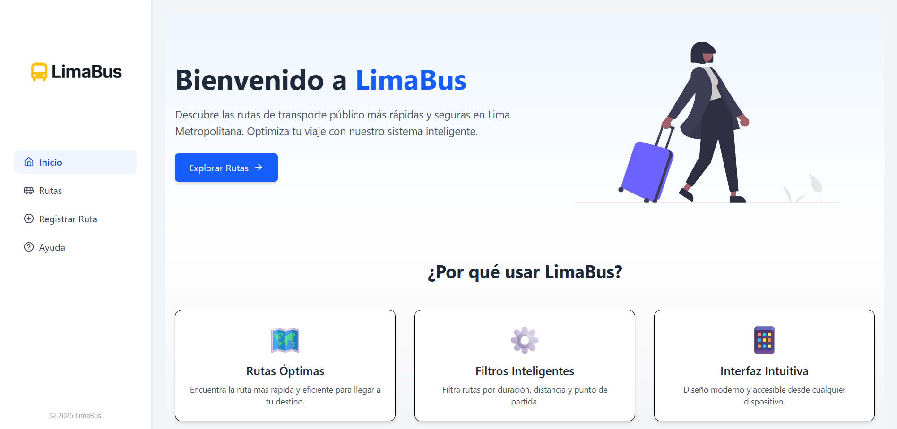

# LimaBus - Frontend 🚍🌆

Frontend del proyecto **LimaBus**, una plataforma web moderna y responsiva que permite a los ciudadanos visualizar rutas de transporte público en Lima Metropolitana, registrar nuevas rutas y acceder a información útil de manera clara e intuitiva.



## 🌐 Tecnologías Utilizadas

- **React** + **TypeScript**
- **TailwindCSS** para estilos utilitarios
- **Framer Motion** para animaciones suaves
- **React Router DOM** para enrutamiento entre páginas
- **Vite** para desarrollo rápido
- **Lucide-react** para iconografía moderna

---

## ✨ Características Principales

- 🌍 **Landing page profesional** con animaciones suaves y diseño moderno
- 🚏 **Listado de rutas** con filtros por duración y distancia
- 📝 **Formulario para registrar nuevas rutas**
- 📱 **Diseño responsivo** y adaptable a dispositivos móviles
- 💡 **Sección de ayuda** visual para usuarios nuevos
- 🔁 Comunicación con el backend Laravel mediante peticiones `GET`, `PUT`, `POST` y `DELETE`

---

## 🛠️ Instalación y Ejecución

```bash
# Clonar el repositorio
git clone https://github.com/tuUsuario/LimaBus-Frontend.git
cd LimaBus-Frontend

# Instalar dependencias
npm install

# Iniciar el servidor de desarrollo
npm run dev

⚠️ Asegúrate de que el backend de Laravel esté corriendo en el puerto correspondiente y permita solicitudes CORS.

```
---

## 📁 Estructura de Carpetas

├── public/
├── src/
│   ├── components/        # Componentes reutilizables
│   ├── pages/             # Páginas principales: Home, RouteList, RegisterRoute, Help
│   ├── assets/            # Imágenes e íconos
│   ├── App.tsx            # Enrutamiento principal
│   └── main.tsx           # Entry point
├── tailwind.config.ts
├── vite.config.ts
└── index.html

---

👨‍💻 Autor
Desarrollado por José Giovanni Laura Silvera
Estudiante de Ciencias de la Computación
